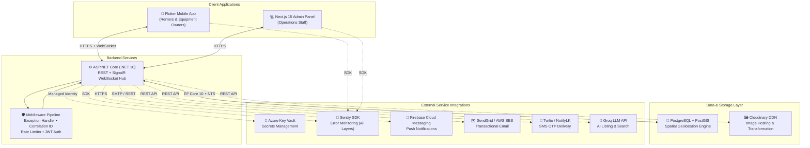
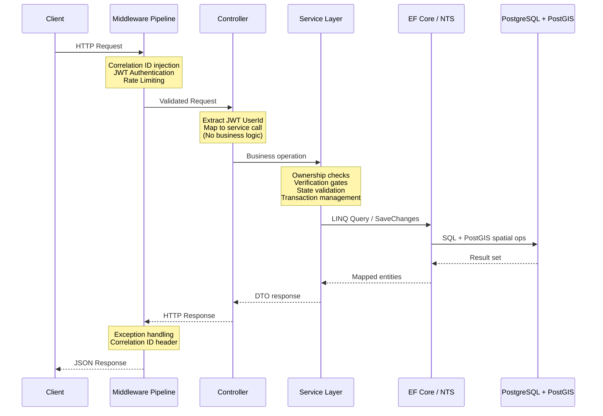
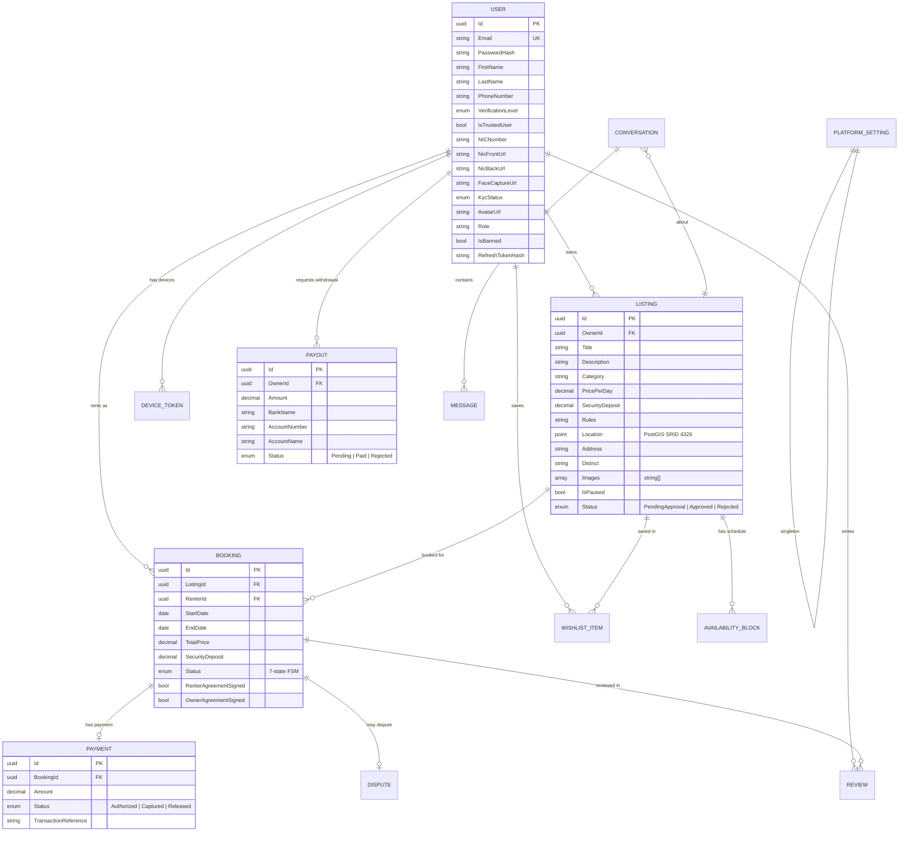
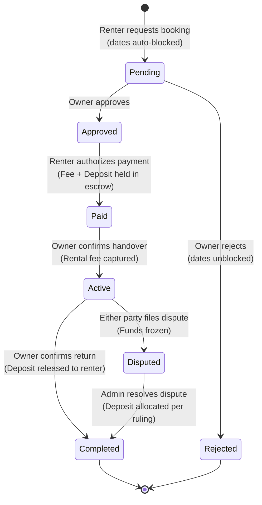
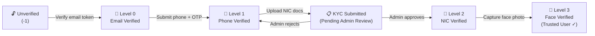

# 🇱🇰 RentLanka — Peer-to-Peer Equipment Rental Marketplace

[](https://dotnet.microsoft.com/)
[](https://flutter.dev/)
[](https://nextjs.org/)
[](https://postgis.net/)
[](https://sentry.io/)
[](https://github.com/features/actions)
[](https://www.terraform.io/)

RentLanka is a production-grade, full-stack peer-to-peer (P2P) equipment rental marketplace designed for the Sri Lankan market. The system enables users to list, discover, book, and rent equipment — cameras, tools, camping gear, electronics — while enforcing multi-level identity verification (KYC), escrow-based payments, geospatial proximity search, real-time messaging, AI-assisted listing generation, and administrative oversight through a dedicated operations dashboard.

---

## Table of Contents

- [Problem Statement \& Solution](#-problem-statement--solution)
- [System Architecture](#-system-architecture)
- [Technology Stack](#-technology-stack)
- [Engineering Concepts \& Design Patterns](#-engineering-concepts--design-patterns)
- [Data Model \& Entity Relationships](#-data-model--entity-relationships)
- [Core Features \& Implementation Details](#-core-features--implementation-details)
- [Booking Lifecycle State Machine](#-booking-lifecycle-state-machine)
- [KYC Identity Verification Pipeline](#-kyc-identity-verification-pipeline)
- [API Endpoint Reference](#-api-endpoint-reference)
- [Security Architecture](#-security-architecture)
- [Observability \& Reliability](#-observability--reliability)
- [CI/CD Pipeline \& Infrastructure](#-cicd-pipeline--infrastructure)
- [Project Structure](#-project-structure)
- [Getting Started](#-getting-started)
- [Testing Strategy](#-testing-strategy)
- [Deployment](#-deployment)
- [Documentation Index](#-documentation-index)
- [License](#-license)

---

## 🎯 Problem Statement & Solution

### The Challenge

| Problem | Impact |
|---------|--------|
| **High purchase costs** | Specialized equipment (DSLRs, power tools, camping gear) is prohibitively expensive in Sri Lanka, especially for students, freelancers, and small businesses |
| **Idle asset waste** | Households and businesses own valuable equipment that sits unused — representing lost earning potential |
| **Trust deficit in P2P** | Without verified identities and binding contracts, users are reluctant to lend high-value items to strangers |
| **Discovery friction** | Renters struggle to find nearby equipment, leading to high transport costs and coordination overhead |

### RentLanka's Engineered Solution

| Solution | Engineering Approach |
|----------|---------------------|
| **Trust via KYC verification** | 4-tier progressive identity verification (Email → SMS OTP → NIC document → Facial biometrics) with admin approval gates |
| **Geospatial proximity search** | PostGIS spatial indexing with `geography(Point, 4326)` coordinate storage, enabling meter-precise distance queries via NetTopologySuite |
| **Financial security via escrow** | State-machine-driven booking lifecycle with authorized payment holds, conditional capture, and automated deposit release |
| **Real-time collaboration** | SignalR WebSocket hubs for instant messaging, Firebase Cloud Messaging (FCM) for push notifications, and transactional email pipelines |
| **AI-powered UX** | Groq LLM integration for intelligent listing auto-generation from photos and natural-language semantic search |

---

## 🏗️ System Architecture

RentLanka follows a **monorepo, three-tier client-server architecture** with a shared RESTful API backend serving two independent client applications.



### Platform Client Split

| Client | Target Users | Technology | Responsibilities |
|--------|-------------|------------|-----------------|
| **Mobile App** | Renters & Equipment Owners | Flutter (Dart) — iOS & Android | Full marketplace: discover, list, book, pay, chat, review, earnings |
| **Admin Dashboard** | Platform Operations Staff | Next.js 15 + React 19 + Tailwind CSS 4 | KYC review, listing moderation, dispute resolution, analytics, payouts |
| **Backend API** | Both clients (shared) | ASP.NET Core (.NET 10) | Single source of truth for all business logic, authentication, and data access |

---

## 🛠️ Technology Stack

### Core Technologies

| Layer | Technology | Version | Purpose |
|-------|-----------|---------|---------|
| **Backend Runtime** | .NET / C# | 10.0 | High-performance, type-safe API server with first-class async support |
| **Web Framework** | ASP.NET Core | 10.0 | REST controller routing, SignalR hubs, middleware pipeline, OpenAPI |
| **ORM** | Entity Framework Core | 10.0 | Code-first migrations, LINQ query translation, change tracking |
| **Mobile Framework** | Flutter / Dart | 3.10 / 3.x | Single codebase cross-platform mobile for iOS and Android |
| **Admin Frontend** | Next.js / React | 15.5 / 19 | Server-side rendering, file-based routing, API proxy middleware |
| **UI Styling** | Tailwind CSS | 4.0 | Utility-first CSS framework for admin dashboard |
| **Database** | PostgreSQL | 18 | ACID-compliant relational database with JSONB and spatial support |
| **Spatial Extension** | PostGIS | 3.x | Geographic coordinate storage, spatial indexing, distance computation |
| **Spatial Library** | NetTopologySuite (NTS) | 2.x | .NET geometry types, coordinate transformation, EF Core spatial integration |

### External Services & Integrations

| Service | Provider | Purpose |
|---------|----------|---------|
| **Image CDN** | Cloudinary | Cloud image upload, transformation, and CDN delivery for avatars and listing photos |
| **Push Notifications** | Firebase Cloud Messaging | Real-time push to mobile devices for booking updates, messages, and system alerts |
| **Transactional Email** | SendGrid / AWS SES | Email verification tokens, booking confirmations, and KYC status notifications |
| **SMS OTP** | Twilio / NotifyLK | Phone number verification via one-time passwords |
| **AI / LLM** | Groq (LLaMA models) | Intelligent listing auto-generation from images and natural-language semantic search |
| **Secrets Management** | Azure Key Vault | Zero-hardcode configuration with managed identity access |
| **Error Monitoring** | Sentry | Cross-layer crash reporting and performance monitoring (API, mobile, web) |

### DevOps & Infrastructure

| Tool | Purpose |
|------|---------|
| **GitHub Actions** | CI/CD: automated build verification, test execution, APK generation, and web deployment |
| **Terraform** | Infrastructure as Code (IaC) for Azure resource provisioning |
| **Docker** | Containerized API deployment with multi-stage builds |
| **Azure Static Web Apps** | Admin dashboard hosting with automatic SSL and global CDN |
| **Neon** | Serverless PostgreSQL hosting with PostGIS extension |

---

## 🧩 Engineering Concepts & Design Patterns

### Architectural Patterns

| Pattern | Implementation |
|---------|---------------|
| **3-Tier Layered Architecture** | Controllers (Presentation) → Services (Business Logic) → Data Access (EF Core). Controllers contain zero business logic; all rules live in service layer implementations |
| **Dependency Injection (DI)** | All 17 services registered via interface abstractions in `Program.cs`. Controllers depend on `IListingService`, never `ListingService` — enabling testability and swappable implementations |
| **Repository Pattern (implicit)** | EF Core `DbContext` acts as both Unit of Work and repository. Services query via LINQ; no raw SQL in business logic |
| **Strategy Pattern** | File storage (`IFileStorageService`) swaps between `CloudinaryFileStorageService` and `S3FileStorageService` via configuration. Email/SMS providers similarly use pluggable strategy implementations |
| **State Machine** | Booking lifecycle enforces a strict FSM: `Pending → Approved → Paid → Active → Completed`. Invalid transitions are rejected at the service layer |
| **DTO Pattern** | Entities are never exposed directly. All API responses use dedicated DTOs (`ListingResponse`, `BookingResponse`, etc.) to prevent internal field leakage |
| **Middleware Pipeline** | Custom ASP.NET Core middleware for cross-cutting concerns: correlation ID injection, global exception handling, rate limiting |

### Backend Engineering



### Mobile Engineering

| Concept | Implementation |
|---------|---------------|
| **Riverpod State Management** | Provider-based reactive state management with `ConsumerWidget` and `ConsumerStatefulWidget` |
| **API Client Abstraction** | Dio HTTP client with interceptors for JWT injection, token refresh, and error extraction |
| **Declarative Navigation** | GoRouter for type-safe, deep-linkable navigation with shell routes |
| **Dual-Mode UX** | Single account toggles between Renter Mode and Owner Mode via `AppModeProvider` |
| **Offline-Resilient UI** | Shimmer skeleton loading states, pull-to-refresh, and graceful error handling |

### Frontend Admin Engineering

| Concept | Implementation |
|---------|---------------|
| **Server-Side Middleware** | Next.js middleware intercepts all `/admin/*` routes to validate JWT before page load |
| **API Proxy Layer** | Centralized `lib/api/admin.ts` module abstracts all backend calls with typed responses |
| **SVG Data Visualization** | Custom hand-built SVG area charts, donut charts, and progress bars — zero charting library dependencies |
| **Responsive Layout** | CSS Grid + Tailwind responsive breakpoints for desktop-first admin experience |

---

## 📊 Data Model & Entity Relationships



### Key Entity Counts

| Entity | Fields | Relationships |
|--------|--------|---------------|
| **User** | 19 fields | KYC metadata, verification tiers, refresh token rotation, device tokens |
| **Listing** | 16 fields | PostGIS spatial `Point`, multi-image array, approval workflow |
| **Booking** | 11 fields | 7-state FSM, dual-party agreement signing |
| **Payment** | 6 fields | Escrow hold/capture/release lifecycle |
| **20 entities total** | — | Full relational schema with cascading FK constraints |

---

## ⚡ Core Features & Implementation Details

### 1. Geospatial Proximity Search Engine

The platform uses **PostGIS** spatial indexing to enable location-aware equipment discovery.

| Component | Technology | Detail |
|-----------|-----------|--------|
| **Storage** | PostGIS `geography(Point, 4326)` | Listing coordinates stored as WGS84 geodetic points |
| **Indexing** | GiST spatial index | Sub-millisecond distance queries over thousands of listings |
| **Computation** | NetTopologySuite (NTS) | Server-side haversine distance calculation with SRID-aware geometry factory |
| **Client** | flutter_map + Geolocator | Real-time GPS capture, map rendering, and "Near Me" radius filtering |
| **Query** | EF Core spatial LINQ | `listing.Location.Distance(userPoint) <= maxMeters` translated to PostGIS `ST_DWithin` |

### 2. Real-Time Messaging System

| Feature | Technology | Detail |
|---------|-----------|--------|
| **WebSocket Hub** | ASP.NET Core SignalR | `ChatHub` for bidirectional real-time message delivery |
| **Persistence** | EF Core + PostgreSQL | All messages stored with encrypted content via AES-256 |
| **Encryption** | AES-256-CBC | Client-side encryption/decryption with per-conversation keys |
| **Notifications** | Firebase Cloud Messaging | Push alerts for new messages when app is backgrounded |

### 3. AI-Powered Listing Assistant

| Feature | Technology | Detail |
|---------|-----------|--------|
| **Image Analysis** | Groq LLM (multimodal) | Analyzes uploaded photos to auto-generate title, description, category, and pricing |
| **Semantic Search** | Groq LLM embeddings | Natural language queries ("camping gear near Kandy under 2000") parsed into structured filters |
| **Fallback** | Keyword matcher | Offline-capable fuzzy word matching with Levenshtein distance when API keys are unavailable |

### 4. Escrow Payment System

| Stage | Action | Financial Effect |
|-------|--------|-----------------|
| **Authorization** | Renter confirms payment | `TotalPrice + SecurityDeposit` authorized (held) |
| **Capture** | Owner confirms handover | Rental fee captured into escrow |
| **Release** | Owner confirms return | Security deposit released back to renter |
| **Dispute** | Either party disputes | Admin reviews and decides deposit allocation |

### 5. Administrative Operations Dashboard

| Module | Functionality |
|--------|-------------|
| **Dashboard** | KPI metrics (users, listings, bookings, KYC queue), SVG area charts (7d/30d trends), donut charts (categories, verification distribution), escrow ledger |
| **User Management** | Search, view profiles, ban/unban, override verification levels |
| **Listing Moderation** | Review pending listings, approve/reject, pause, soft-delete |
| **KYC Queue** | Review submitted NIC documents and facial captures, approve/reject with reasons |
| **Dispute Resolution** | Review evidence from both parties, resolve with deposit allocation rationale |
| **Financial Ledger** | Escrow payment audit log, host payout withdrawal request processing |
| **Platform Settings** | Dynamic commission rate configuration, marketplace category management |

### 6. Earnings & Payout System

| Feature | Detail |
|---------|--------|
| **Commission** | Configurable platform fee (default 10%) deducted from completed rental fees |
| **Earnings Dashboard** | Mobile screen showing available balance, total earned, escrowed funds, monthly chart |
| **Payout Requests** | Hosts submit bank withdrawal requests (requires Level 2 KYC verification) |
| **Admin Approval** | Operations staff reviews and confirms bank transfer completion |

---

## 🔄 Booking Lifecycle State Machine

The booking system implements a **7-state finite state machine** with strict transition rules enforced at the service layer.



### State Transition Rules

| Transition | Pre-conditions | Side Effects |
|------------|---------------|-------------|
| `→ Pending` | Both parties KYC Level 2+, dates available, renter signed agreement | Availability dates auto-blocked |
| `→ Approved` | Caller is listing owner | Push notification to renter |
| `→ Rejected` | Caller is listing owner | Availability dates unblocked |
| `→ Paid` | Caller is renter, booking is approved | Payment record created, push to owner |
| `→ Active` | Caller is owner or renter, booking is paid | Rental fee captured |
| `→ Completed` | Caller is owner, booking is active | Security deposit released, push to renter |
| `→ Disputed` | Booking is active, dispute reason provided | Dispute record created, admin notified |

---

## 🔐 KYC Identity Verification Pipeline

RentLanka implements a **progressive 4-tier identity verification system** that gates platform capabilities.



### Capability Gates

| Capability | Minimum Level | Rationale |
|-----------|--------------|-----------|
| Browse & search listings | Unverified | Open discovery to attract users |
| Create listings | Level 0 (Email) | Minimum identity binding |
| Send booking requests | Level 2 (NIC) | Require government ID before financial transactions |
| Accept bookings as owner | Level 2 (NIC) | Both parties must be verified |
| Request payout withdrawal | Level 2 (NIC) | Bank transfers require verified identity |
| Trusted User badge | Level 3 (Face) | Highest trust signal for other users |

---

## 📡 API Endpoint Reference

### Authentication & Identity (`/api/auth`)

| Method | Endpoint | Auth | Description |
|--------|----------|------|-------------|
| `POST` | `/api/auth/register` | Public | Register new user account |
| `POST` | `/api/auth/login` | Public | Authenticate and receive JWT + Refresh Token |
| `POST` | `/api/auth/refresh` | Public | Rotate expired access token using refresh token |

### Verification (`/api/verification`)

| Method | Endpoint | Auth | Description |
|--------|----------|------|-------------|
| `POST` | `/api/verification/email/send` | Bearer | Send email verification token |
| `POST` | `/api/verification/email/confirm` | Bearer | Confirm email with token |
| `POST` | `/api/verification/phone/send` | Bearer | Send SMS OTP to phone |
| `POST` | `/api/verification/phone/confirm` | Bearer | Verify phone with OTP |
| `POST` | `/api/verification/nic/submit` | Bearer | Upload NIC document for KYC |
| `POST` | `/api/verification/face/submit` | Bearer | Upload facial biometric capture |

### Listings (`/api/listings`)

| Method | Endpoint | Auth | Description |
|--------|----------|------|-------------|
| `POST` | `/api/listings` | Bearer | Create new equipment listing |
| `GET` | `/api/listings/{id}` | Public | Get listing details with owner metadata |
| `GET` | `/api/listings/search` | Public | Spatial search with filters (category, district, coordinates, radius, price range) |
| `GET` | `/api/listings/my` | Bearer | Get current user's own listings |
| `PUT` | `/api/listings/{id}` | Bearer | Update listing details |
| `DELETE` | `/api/listings/{id}` | Bearer | Soft-delete listing (ownership enforced) |
| `PATCH` | `/api/listings/{id}/pause` | Bearer | Toggle listing availability |
| `GET` | `/api/listings/settings` | Public | Get platform categories |

### Bookings (`/api/bookings`)

| Method | Endpoint | Auth | Description |
|--------|----------|------|-------------|
| `POST` | `/api/bookings` | Bearer | Create booking request |
| `GET` | `/api/bookings/renter` | Bearer | Get current user's rental bookings |
| `GET` | `/api/bookings/owner` | Bearer | Get bookings for user's listings |
| `POST` | `/api/bookings/{id}/approve` | Bearer | Owner approves request |
| `POST` | `/api/bookings/{id}/reject` | Bearer | Owner rejects request |
| `POST` | `/api/bookings/{id}/pay` | Bearer | Renter authorizes payment |
| `POST` | `/api/bookings/{id}/handover` | Bearer | Confirm item handover |
| `POST` | `/api/bookings/{id}/return` | Bearer | Confirm item return |
| `GET` | `/api/bookings/{listingId}/availability` | Public | Get listing availability calendar |

### Messaging (`/api/chats`)

| Method | Endpoint | Auth | Description |
|--------|----------|------|-------------|
| `POST` | `/api/chats/listing/{id}` | Bearer | Create or get conversation for listing |
| `GET` | `/api/chats` | Bearer | Get all user conversations |
| `GET` | `/api/chats/{id}/messages` | Bearer | Get messages in conversation |
| `POST` | `/api/chats/{id}/messages` | Bearer | Send message (AES-256 encrypted) |
| **WS** | `/hubs/chat` | Bearer | SignalR hub for real-time delivery |

### Reviews (`/api/reviews`)

| Method | Endpoint | Auth | Description |
|--------|----------|------|-------------|
| `POST` | `/api/reviews` | Bearer | Submit review for completed booking |
| `GET` | `/api/reviews/listing/{id}` | Public | Get reviews for a listing |
| `GET` | `/api/reviews/listing/{id}/average` | Public | Get average star rating |
| `GET` | `/api/reviews/booking/{id}` | Bearer | Get reviews for a specific booking |

### Files (`/api/file`)

| Method | Endpoint | Auth | Description |
|--------|----------|------|-------------|
| `POST` | `/api/file/avatar` | Bearer | Upload user profile avatar |
| `POST` | `/api/file/listing-image` | Bearer | Upload listing photo |

### Earnings & Payouts (`/api/bookings/earnings`)

| Method | Endpoint | Auth | Description |
|--------|----------|------|-------------|
| `GET` | `/api/bookings/earnings` | Bearer | Get host earnings summary |
| `POST` | `/api/bookings/earnings/payout` | Bearer | Request bank withdrawal |

### Admin Operations (`/api/admin`)

| Method | Endpoint | Auth | Description |
|--------|----------|------|-------------|
| `GET` | `/api/admin/dashboard` | Admin | Aggregated platform KPIs and analytics |
| `GET` | `/api/admin/users` | Admin | Paginated user management |
| `POST` | `/api/admin/users/{id}/ban` | Admin | Toggle user ban status |
| `POST` | `/api/admin/users/{id}/verify` | Admin | Override verification level |
| `GET` | `/api/admin/listings` | Admin | All listings with moderation filters |
| `POST` | `/api/admin/listings/{id}/approve` | Admin | Approve listing for marketplace |
| `POST` | `/api/admin/listings/{id}/reject` | Admin | Reject listing submission |
| `GET` | `/api/admin/kyc` | Admin | KYC review queue |
| `POST` | `/api/admin/kyc/{id}/approve` | Admin | Approve KYC verification |
| `POST` | `/api/admin/kyc/{id}/reject` | Admin | Reject KYC with reason |
| `GET` | `/api/admin/disputes` | Admin | List all platform disputes |
| `POST` | `/api/admin/disputes/{id}/resolve` | Admin | Resolve dispute with ruling |
| `GET` | `/api/admin/payments` | Admin | Escrow payment audit log |
| `GET` | `/api/admin/payouts` | Admin | Host payout requests |
| `POST` | `/api/admin/payouts/{id}/approve` | Admin | Confirm bank transfer completion |
| `GET` | `/api/admin/bookings` | Admin | All platform bookings |

### Settings (`/api/settings`)

| Method | Endpoint | Auth | Description |
|--------|----------|------|-------------|
| `GET` | `/api/settings` | Admin | Get platform configuration |
| `PUT` | `/api/settings` | Admin | Update commission rate and categories |

### AI Services (`/api/ai`)

| Method | Endpoint | Auth | Description |
|--------|----------|------|-------------|
| `POST` | `/api/ai/generate-listing` | Bearer | Auto-generate listing details from image |
| `POST` | `/api/ai/smart-search` | Public | Natural language semantic search |

---

## 🛡️ Security Architecture

| Layer | Mechanism | Implementation |
|-------|-----------|---------------|
| **Authentication** | JWT Bearer Tokens | HMAC-SHA256 signed, configurable expiry, issued on login |
| **Token Rotation** | Refresh Token Flow | BCrypt-hashed refresh tokens with sliding expiry, single-use rotation |
| **Password Security** | BCrypt Hashing | Cost factor 12, no plaintext storage |
| **Authorization** | Role-based Access Control | `User` and `Admin` roles enforced via JWT claims and `[Authorize(Roles = "Admin")]` |
| **Resource Ownership** | Service-layer enforcement | Every mutation verifies `resource.OwnerId == currentUserId` before proceeding |
| **Secrets Management** | Azure Key Vault | Production secrets loaded via managed identity — zero hardcoded credentials |
| **Rate Limiting** | ASP.NET Core Rate Limiter | Fixed-window rate limiting to prevent API abuse |
| **CORS** | Strict origin allowlist | Only registered client origins permitted |
| **Input Validation** | Model binding + Service validation | Request DTOs validate shape; services validate business rules |
| **Error Handling** | RFC 7807 Problem Details | Standardized error responses with correlation IDs; stack traces hidden in production |
| **Message Encryption** | AES-256-CBC | Chat messages encrypted at rest and in transit |
| **Soft Delete** | `IsDeleted` flag | User and listing data preserved for audit trail rather than hard-deleted |

---

## 📈 Observability & Reliability

| Concern | Technology | Detail |
|---------|-----------|--------|
| **Structured Logging** | Serilog | JSON-formatted logs with enriched properties (user ID, correlation ID, request path) |
| **Correlation Tracing** | Custom Middleware | `X-Correlation-ID` header injected into every request/response and pushed into Serilog `LogContext` for end-to-end trace linking |
| **Error Monitoring** | Sentry SDK | Unhandled exception capture across all three layers (API, Mobile, Web) with source maps and breadcrumbs |
| **Performance Tracing** | Sentry Performance | Transaction-level tracing with configurable sample rate |
| **Global Exception Handler** | `ExceptionMiddleware` | Catches all unhandled exceptions, logs with correlation ID, returns RFC 7807 `ProblemDetails` |
| **Health Monitoring** | ASP.NET Health Checks | Database connectivity and service health endpoints |

---

## 🚀 CI/CD Pipeline & Infrastructure

### GitHub Actions Workflows

| Workflow | Trigger | Steps |
|----------|---------|-------|
| **`ci.yml`** | Push/PR to `main` | Restore → Build → Test (xUnit) → Lint analysis |
| **`build-apk.yml`** | Push to `main` | Flutter build → APK artifact upload |
| **`deploy.yml`** | Push to `main` | Docker build → Azure Container deployment |
| **`azure-static-web-apps`** | Push to `main` | Next.js build → Azure Static Web Apps deployment |

### Infrastructure as Code

```text
terraform/
└── main.tf    # Azure resource declarations (App Service, PostgreSQL, Key Vault, Static Web App)
```

All cloud resources are declared in Terraform HCL — enabling reproducible, version-controlled infrastructure provisioning.

---

## 📁 Project Structure

```text
RentLanka/
├── api/                          # Backend REST API (ASP.NET Core / .NET 10)
│   ├── Controllers/              # 15 HTTP controllers (Presentation Layer)
│   │   ├── AuthController.cs         # Registration, login, token refresh
│   │   ├── ListingsController.cs     # CRUD + spatial search + AI generation
│   │   ├── BookingsController.cs     # Booking FSM transitions + availability
│   │   ├── ChatsController.cs        # Messaging CRUD
│   │   ├── ReviewsController.cs      # Star ratings and comments
│   │   ├── AdminController.cs        # Admin operations (users, listings, KYC, disputes)
│   │   ├── VerificationController.cs # Email, phone, NIC, face verification
│   │   ├── DisputesController.cs     # Dispute filing
│   │   ├── SettingsController.cs     # Platform configuration
│   │   ├── AiController.cs           # AI listing generation + semantic search
│   │   ├── FileController.cs         # Image upload endpoints
│   │   ├── UsersController.cs        # User profile operations
│   │   ├── NotificationsController.cs # Device token management
│   │   ├── WishlistController.cs     # Saved listings
│   │   └── AuthorizedControllerBase.cs # Shared JWT user ID extraction
│   ├── Services/                 # Business Logic Layer (17 service interfaces)
│   │   ├── Interfaces/               # Dependency-injected contracts
│   │   └── Implementations/         # Concrete implementations
│   │       ├── IdentityService.cs        # Auth, JWT generation, refresh rotation
│   │       ├── ListingService.cs         # Listing CRUD + PostGIS queries
│   │       ├── BookingService.cs         # 7-state FSM + escrow logic
│   │       ├── ChatService.cs            # Conversation + message management
│   │       ├── ReviewService.cs          # Rating aggregation + duplicate prevention
│   │       ├── AdminService.cs           # Dashboard stats + moderation
│   │       ├── DisputeService.cs         # Dispute lifecycle management
│   │       ├── EarningsService.cs        # Commission calculation + payout processing
│   │       ├── VerificationService.cs    # 4-tier KYC pipeline
│   │       ├── GeminiAiService.cs        # LLM integration + fallback handlers
│   │       ├── CloudinaryFileStorageService.cs # CDN image management
│   │       ├── FcmNotificationService.cs # Firebase push delivery
│   │       ├── EmailService.cs           # Multi-provider email dispatch
│   │       ├── SmsService.cs             # Multi-provider SMS dispatch
│   │       └── SettingsService.cs        # Dynamic platform configuration
│   ├── Models/                   # Domain Model Layer
│   │   ├── Entities/                 # 20 EF Core entity classes
│   │   ├── DTOs/                     # 14 API response records
│   │   └── Requests/                # Incoming HTTP body records
│   ├── Data/                     # Data Access Layer
│   │   └── AppDbContext.cs           # EF Core context + PostGIS + Fluent API
│   ├── Middleware/               # Cross-cutting concerns
│   │   ├── CorrelationIdMiddleware.cs    # Request tracing
│   │   └── ExceptionMiddleware.cs        # Global error handling
│   ├── Hubs/                     # SignalR WebSocket hubs
│   │   └── ChatHub.cs                # Real-time messaging
│   ├── Migrations/               # EF Core schema migrations
│   └── Program.cs               # DI registration + middleware pipeline
│
├── api.tests/                    # Automated test suite (xUnit)
│   ├── IdentityServiceTests.cs       # Auth + JWT unit tests
│   └── SettingsServiceTests.cs       # Platform settings unit tests
│
├── web/                          # Next.js 15 Admin Dashboard
│   └── src/
│       ├── app/
│       │   ├── admin/
│       │   │   ├── page.tsx              # Dashboard overview (charts + KPIs)
│       │   │   ├── layout.tsx            # Admin shell (sidebar + navigation)
│       │   │   ├── users/page.tsx        # User management
│       │   │   ├── listings/page.tsx     # Listing moderation
│       │   │   ├── bookings/page.tsx     # Booking oversight
│       │   │   ├── kyc/page.tsx          # KYC review queue
│       │   │   ├── disputes/page.tsx     # Dispute resolution
│       │   │   ├── payments/page.tsx     # Financial ledger + payouts
│       │   │   └── settings/page.tsx     # Platform configuration
│       │   └── login/page.tsx        # Admin authentication
│       ├── components/               # Reusable UI components
│       ├── lib/                      # API client + utilities
│       └── middleware.ts             # JWT route protection
│
├── mobile/                       # Flutter Mobile Application
│   └── lib/
│       ├── core/
│       │   ├── api/                  # API client layer (Dio + interceptors)
│       │   ├── models/               # Dart model classes
│       │   ├── providers/            # Riverpod state providers
│       │   ├── services/             # Device services (notifications, encryption)
│       │   ├── router/               # GoRouter navigation
│       │   ├── theme/                # Design system tokens
│       │   └── constants.dart        # App configuration
│       ├── features/
│       │   ├── explore/              # Home feed, listing detail, booking request, search
│       │   ├── activity/             # Booking management (renter & owner views)
│       │   ├── listings/             # Create + edit listing (with AI assist)
│       │   ├── chat/                 # Encrypted real-time messaging
│       │   ├── profile/              # Profile, verification, earnings, notifications
│       │   ├── saved/                # Wishlist / saved items
│       │   └── auth/                 # Login + registration
│       └── shared/widgets/           # Reusable UI components
│
├── terraform/                    # Infrastructure as Code
│   └── main.tf                       # Azure resource declarations
│
├── doc/                          # Project documentation
│   ├── 01_market_analysis_and_roadmap.md
│   ├── 02_architecture_and_structure.md
│   ├── 03_application_flow.md
│   ├── 04_ui_ux_layout.md
│   ├── 05_full_implementation_plan.md
│   ├── 06_development_rules.md
│   ├── 07_firebase_fcm_setup_guide.md
│   ├── 08_ui_ux_design_system.md
│   ├── deployment_guide.md
│   └── devops_improve.md
│
├── .github/workflows/            # CI/CD pipeline definitions
│   ├── ci.yml                        # Build + test on push/PR
│   ├── build-apk.yml                 # Flutter APK generation
│   ├── deploy.yml                    # Docker deployment
│   └── azure-static-web-apps-*.yml   # Admin dashboard deployment
│
├── RentLanka.slnx                # .NET Solution file
├── .env.example                  # Environment variable template
└── .gitignore                    # Repository exclusion rules
```

---

## 🚀 Getting Started

### Prerequisites

| Tool | Version | Installation |
|------|---------|-------------|
| **.NET SDK** | 10.0+ | [dotnet.microsoft.com](https://dotnet.microsoft.com/download) |
| **Flutter SDK** | 3.10+ (Stable) | [flutter.dev](https://flutter.dev/docs/get-started/install) |
| **Node.js** | 18+ | [nodejs.org](https://nodejs.org/) |
| **PostgreSQL** | 16+ | `brew install postgresql` (macOS) |
| **PostGIS Extension** | 3.x | `brew install postgis` (macOS) |

### 1. Backend API (`/api`)

```bash
# 1. Configure environment
cp .env.example api/.env
# Edit api/.env with your database credentials and service keys

# 2. Apply database migrations (creates schema + PostGIS spatial indexes)
dotnet ef database update --project api/RentLanka.Api.csproj

# 3. Start the API server
dotnet run --project api/RentLanka.Api.csproj
```

The API will be available at `http://localhost:5021` with OpenAPI specification at `/openapi/v1.json`.

### 2. Admin Dashboard (`/web`)

```bash
cd web

# 1. Install dependencies
npm install

# 2. Configure environment
echo 'NEXT_PUBLIC_API_URL=http://localhost:5021' > .env.local

# 3. Launch development server
npm run dev
```

The admin dashboard runs at `http://localhost:3000`.

### 3. Mobile Application (`/mobile`)

```bash
cd mobile

# 1. Install dependencies
flutter pub get

# 2. Run on connected device or emulator
flutter run --dart-define=API_BASE_URL=http://YOUR_LOCAL_IP:5021
```

> **Note:** Replace `YOUR_LOCAL_IP` with your machine's LAN IP (not `localhost`) for physical device testing.

### Environment Variables Reference

| Variable | Required | Description |
|----------|----------|-------------|
| `DATABASE_URL` | ✅ | PostgreSQL connection string |
| `JwtSettings__Secret` | ✅ (Production) | JWT signing secret (auto-generated in dev) |
| `EmailSettings__Provider` | ❌ | `Console` \| `SendGrid` \| `Smtp` (default: Console) |
| `SmsSettings__Provider` | ❌ | `Console` \| `Twilio` \| `NotifyLk` (default: Console) |
| `FileStorageSettings__Provider` | ❌ | `Local` \| `Cloudinary` (default: Local) |
| `Sentry__Dsn` | ❌ | Sentry DSN for error monitoring |
| `FirebaseSettings__CredentialFilePath` | ❌ | Path to Firebase service account JSON |

---

## 🧪 Testing Strategy

### Automated Tests

```bash
# Run all backend unit tests
dotnet test api.tests/api.tests.csproj
```

| Test Suite | Framework | Coverage |
|-----------|-----------|----------|
| `IdentityServiceTests` | xUnit + EF Core InMemory | JWT generation, user registration, password validation |
| `SettingsServiceTests` | xUnit + EF Core InMemory | Commission rate CRUD, category management, validation |

### CI/CD Validation

All pushes and pull requests to `main` trigger automated:
- ✅ .NET build verification
- ✅ xUnit test execution
- ✅ Flutter static analysis (`flutter analyze`)
- ✅ Next.js build verification

---

## 🌐 Deployment

| Environment | URL | Platform |
|------------|-----|----------|
| **Admin Dashboard** | [lemon-rock-00c82da00.7.azurestaticapps.net](https://lemon-rock-00c82da00.7.azurestaticapps.net) | Azure Static Web Apps |
| **Mobile APK** | [GitHub Actions Artifacts](https://github.com/sasindu345/RentLanka/actions) | GitHub Actions CI/CD |
| **API Backend** | Azure App Service (Docker) | Azure Container Registry |
| **Database** | Neon PostgreSQL | Serverless + PostGIS |

---

## 📚 Documentation Index

| Document | Description |
|----------|-------------|
| [`01_market_analysis_and_roadmap.md`](doc/01_market_analysis_and_roadmap.md) | Competitive analysis (Fat Llama, ShareGrid) and phased build strategy |
| [`02_architecture_and_structure.md`](doc/02_architecture_and_structure.md) | 3-tier layered architecture specification and data flow diagrams |
| [`03_application_flow.md`](doc/03_application_flow.md) | User journeys: Renter, Owner, and Admin flows with use case matrix |
| [`04_ui_ux_layout.md`](doc/04_ui_ux_layout.md) | Screen inventory, navigation structure, and wireframe specifications |
| [`05_full_implementation_plan.md`](doc/05_full_implementation_plan.md) | Master implementation roadmap with phase-by-phase task breakdown |
| [`06_development_rules.md`](doc/06_development_rules.md) | Engineering conventions for API, web, and mobile development |
| [`07_firebase_fcm_setup_guide.md`](doc/07_firebase_fcm_setup_guide.md) | Firebase Cloud Messaging configuration guide |
| [`08_ui_ux_design_system.md`](doc/08_ui_ux_design_system.md) | Design system tokens, component specs, and theming guide |
| [`deployment_guide.md`](doc/deployment_guide.md) | Production deployment procedures for all platforms |
| [`devops_improve.md`](doc/devops_improve.md) | DevOps maturity improvement roadmap |

---

## 📄 License

This project is developed as an academic/portfolio project. All rights reserved.
