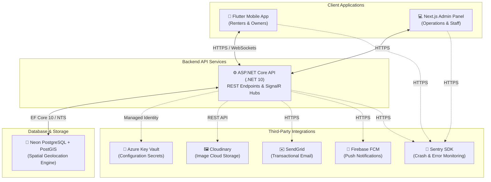

# 🇱🇰 RentLanka — Peer-to-Peer Equipment Rental Marketplace

[](https://dotnet.microsoft.com/)
[](https://flutter.dev/)
[](https://nextjs.org/)
[](https://sentry.io/)

RentLanka is a premium, secure peer-to-peer (P2P) equipment rental marketplace tailored specifically for Sri Lanka. It enables users to list tools, photography gear, camping gear, and event equipment for rent, while facilitating secure transactions, identity verification, and geographic discovery.

---

## 🌐 Live Environments & Client Downloads

* **Live Admin Dashboard:** [lemon-rock-00c82da00.7.azurestaticapps.net](https://lemon-rock-00c82da00.7.azurestaticapps.net)
* **Mobile Client (APK) Download:** [GitHub Actions Artifacts](https://github.com/sasindu345/RentLanka/actions) (Download the built APK under the latest release action run)

---

## 🎯 The Problem & Our Solution

### The Challenge
1. **High Purchase Costs**: Specialized equipment (e.g., DSLRs, construction tools, power generators) is extremely expensive to purchase outright in Sri Lanka, especially for students, freelancers, and small businesses.
2. **Idle Assets**: Households and businesses own valuable equipment that sits idle, gathering dust, representing wasted earning potential.
3. **Lack of Trust**: P2P rentals are plagued by fraud, theft, and damage. Without verified identities and clear contracts, individuals are reluctant to lend high-value items.
4. **Discovery & Geolocation**: Renters struggle to find nearby equipment, leading to high transportation costs and coordination bottlenecks.

### The RentLanka Solution
* **Trust & Verification (KYC)**: Multi-level verification including SMS OTP validation, National Identity Card (NIC) submissions, and facial biometrics to establish a "Trusted Renter" rating.
* **Geospatial Proximity Search**: Utilizes **PostGIS** spatial indexing to enable renters to locate gear within precise meter radiuses of their current location.
* **Real-time Collaboration**: Built-in SignalR real-time messaging, immediate Firebase push notifications, and automated transactional emails.
* **Cost-effective Infrastructure**: Designed to run efficiently on Microsoft Azure using cloud-native managed identities and cost-optimized student tiers.

---

## 🏗️ System Architecture



### Directory Structure
```text
RentLanka/
├── api/                  # Backend REST API (ASP.NET Core / .NET 10)
│   ├── Controllers/      # Presentation Layer (HTTP controllers)
│   ├── Services/         # Business Logic Layer (Interfaces & Implementations)
│   ├── Models/           # Domain Entities, Requests, and DTOs
│   ├── Data/             # Database context (EF Core 10)
│   ├── Middleware/       # Global pipelines (Exception handling, Correlation ID)
│   └── Migrations/       # Database schema migrations
├── api.tests/            # Backend automated xUnit test suite
├── web/                  # Next.js 15 Admin Operations Dashboard
├── mobile/               # Flutter (Dart) mobile application (Renter & Owner client)
├── terraform/            # Infrastructure as Code (IaC) deployment blueprints
└── doc/                  # Product roadmap, specifications, and guides
```

---

## 🛠️ Technology Stack

| Layer | Technology | Purpose |
|---|---|---|
| **Backend API** | .NET 10 (C#) & ASP.NET Core | REST Endpoints, SignalR, Background workers |
| **Mobile Client** | Flutter 3.10 & Dart 3 | Cross-platform client for iOS & Android |
| **Web Admin** | Next.js 15 & React 19 | Admin Operations portal with Tailwind CSS 4 |
| **Database** | PostgreSQL 18 + **PostGIS** | Spatial database storing geodetic coordinates |
| **Spatial Engine** | NetTopologySuite (NTS) | Computes distances, coordinates, and district bounds |
| **File Storage** | Cloudinary | CDN-backed image hosting for user avatars and listings |
| **Logging & Tracing**| Serilog + Application Insights | Structured JSON logs correlated via custom request IDs |
| **Configuration** | Azure Key Vault | Dynamic, zero-hardcode configuration secrets loader |
| **Error Monitoring** | Sentry SDK | Capture and alert unhandled exceptions on all three layers |
| **CI/CD** | GitHub Actions | Automated compiler checks and release builds |
| **Infrastructure** | Terraform | Declared blueprint scripts for automated cloud resources |

---

## 🚀 Getting Started

### Prerequisites
1. **.NET 10 SDK**
2. **Flutter SDK** (stable channel)
3. **Node.js** (v18+)
4. **PostgreSQL** + **PostGIS Spatial Extension** (`brew install postgis` on macOS)

---

### 1. Backend Local Setup (`/api`)

1. **Local Configuration**
   Duplicate `api/.env.example` as `api/.env` and configure your database connection and third-party secrets:
   ```env
   DATABASE_URL="Host=localhost;Database=rentlanka_db;Username=YOUR_USERNAME;Password=YOUR_PASSWORD"
   Sentry__Dsn="YOUR_SENTRY_DSN"
   ```

2. **Apply Migrations**
   Generate your database schemas and configure spatial indexes automatically:
   ```bash
   dotnet ef database update --project api/RentLanka.Api.csproj
   ```

3. **Start the API Server**
   ```bash
   dotnet run --project api/RentLanka.Api.csproj
   ```
   The API will listen at `http://localhost:5021` with interactive OpenAPI documentation available at `http://localhost:5021/openapi/v1.json`.

---

### 2. Frontend Admin Dashboard Setup (`/web`)

1. **Install Packages**
   ```bash
   cd web
   npm install
   ```

2. **Configure Environment**
   Verify the Next.js backend endpoint and Sentry configurations inside `web/.env.local`:
   ```env
   NEXT_PUBLIC_API_URL=http://localhost:5021
   SENTRY_DSN="YOUR_SENTRY_DSN"
   NEXT_PUBLIC_SENTRY_DSN="YOUR_SENTRY_DSN"
   ```

3. **Launch Dashboard**
   ```bash
   npm run dev
   ```
   The dashboard runs at `http://localhost:3000`.

---

### 3. Mobile Client Setup (`/mobile`)

1. **Install Packages**
   ```bash
   cd mobile
   flutter pub get
   ```

2. **Run App Client**
   Specify Sentry DSN parameters at compile-time:
   ```bash
   flutter run --dart-define=SENTRY_DSN="YOUR_SENTRY_DSN"
   ```

---

## 🔌 Core API Endpoints

### 🔐 Authentication (`/api/auth`)
* `POST /api/auth/register` - Registers a new renter/owner user.
* `POST /api/auth/login` - Authenticates credentials and returns a JWT + Refresh Token.
* `POST /api/auth/refresh` - Validates expired access tokens and returns rotated credentials.

### 📍 Listings (`/api/listings`)
* `POST /api/listings` *(Authorized)* - Submits a new rental item with location coordinates.
* `GET /api/listings/{id}` - Retrieves listing details (includes owner metadata).
* `GET /api/listings/search` - Spatial proximity queries based on user meters, text tokens, and districts.
* `PUT /api/listings/{id}` *(Authorized)* - Updates a listing.
* `DELETE /api/listings/{id}` *(Authorized)* - Soft-deletes a listing.
* `PATCH /api/listings/{id}/pause` *(Authorized)* - Toggles listing availability.

### 📸 Files (`/api/file`)
* `POST /api/file/avatar` *(Authorized)* - Upload user profile avatar.
* `POST /api/file/listing-image` *(Authorized)* - Upload listing photos.
