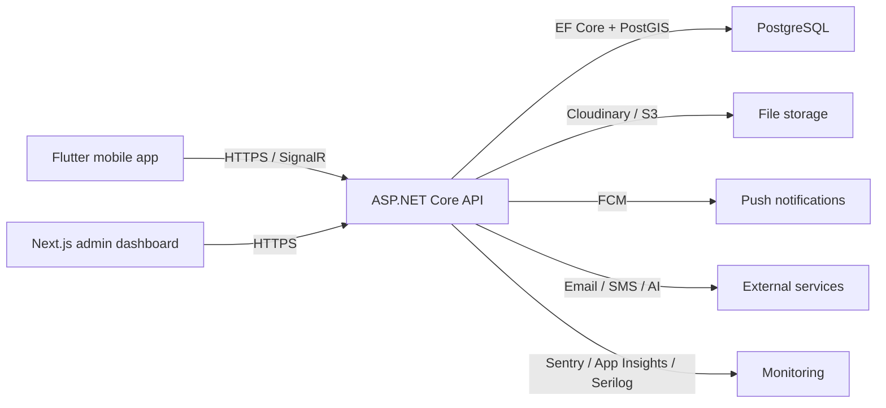
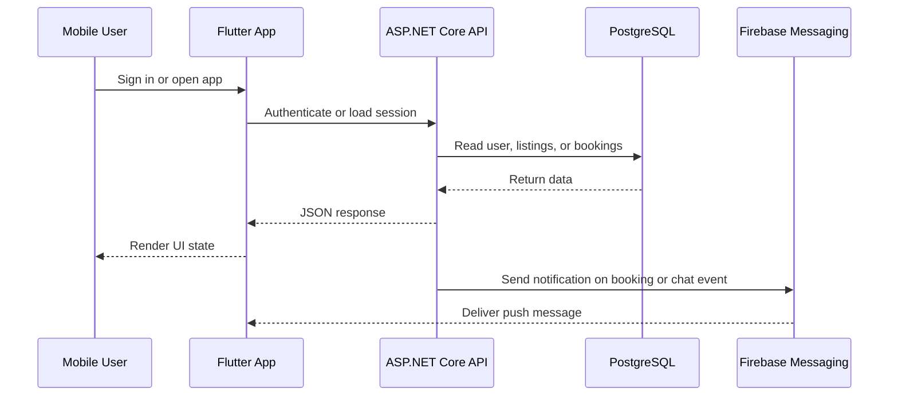
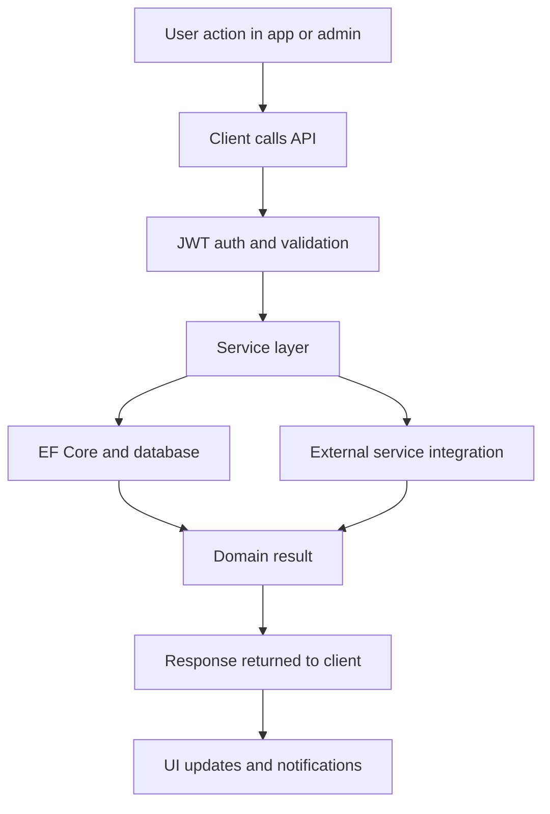

# RentLanka

RentLanka is a peer-to-peer equipment rental platform built for Sri Lanka. The repository contains a .NET API, a Flutter mobile app, and a Next.js admin dashboard. The implementation focuses on the core product workflows: listings, bookings, chat, verification, reviews, disputes, notifications, and admin operations.

## Overview

The codebase is organized as a monorepo so the mobile app, admin dashboard, and backend API can evolve together. The API provides the business logic, the Flutter app serves renters and equipment owners, and the Next.js app is used for platform administration and moderation.

The main user journeys are:
- create and manage rental listings
- discover listings with search and map support
- book equipment and track booking status
- chat in realtime with another user
- complete verification steps for trust and safety
- manage reviews, disputes, notifications, and payouts
- operate the platform from an admin console

## What Is Included

### Mobile app
- Flutter app for renters and equipment owners
- Auth flows with email/password and Google Sign-In
- Listing browsing, search, creation, editing, and saved items
- Booking flow, reviews, earnings, profile management, and notifications
- Chat with message encryption and SignalR-based realtime updates
- Verification flow for email, SMS, NIC, and face capture
- Map and location-based search using device location
- State management with Riverpod and navigation with GoRouter
- API integration through Dio with authenticated requests and token refresh handling
- Secure local storage for session data
- Camera and image capture support for listing and verification flows

### Admin dashboard
- Next.js 15 admin interface with React 19 and TypeScript
- KPI dashboard, bookings, users, listings, payments, disputes, KYC, and settings screens
- Leaflet-based admin map view for listing locations
- Sentry instrumentation for web error tracking
- Data fetching through a dedicated API client layer
- Admin route structure for operational screens

### Backend API
- ASP.NET Core API on .NET 10
- Entity Framework Core with PostgreSQL and PostGIS via NetTopologySuite
- JWT authentication and role-based authorization
- SignalR hub for realtime chat
- File storage with Cloudinary and AWS S3 implementations
- Notification, email, SMS, AI, and identity services
- Logging and monitoring with Serilog, Sentry, and Application Insights
- CORS policy support for web and mobile clients
- Rate limiting for sensitive endpoints such as authentication

## Core Product Areas

### Authentication and identity
- Registration, login, token refresh, and Google sign-in support on the mobile app
- JWT-based authentication on the API
- Progressive verification flow with email, SMS, NIC, and face verification
- Admin controls for reviewing and managing verification state

### Listings and search
- Listing creation, editing, pause and resume operations, and listing images
- Search and discovery using location-aware queries
- Map views for visualizing listing locations in mobile and admin surfaces
- Wishlist and saved listing support

### Bookings and payments
- Booking lifecycle and status handling on the API
- Booking management screens in the mobile app and admin dashboard
- Earnings and payout views for owners
- Payment and payout tracking in admin

### Chat and notifications
- Realtime chat through SignalR
- Encrypted chat payloads in the mobile client
- Firebase Cloud Messaging for push notifications
- Notification APIs and notification screens in the app

### Admin operations
- Dashboard metrics and trend views
- User moderation and listing moderation
- KYC review queue
- Dispute resolution tools
- Platform settings and operational management

## Technology Stack

| Area | Technologies |
| --- | --- |
| Backend | ASP.NET Core, .NET 10, Entity Framework Core, Npgsql, NetTopologySuite, SignalR, JWT, Serilog |
| Database | PostgreSQL, PostGIS |
| Mobile | Flutter, Riverpod, GoRouter, Dio, Firebase Core, Firebase Messaging, Sentry Flutter, Google Sign-In, Flutter Map, Geolocator, Encrypt |
| Web | Next.js 15, React 19, TypeScript, Tailwind CSS 4, Leaflet, React Leaflet, Sentry |
| Storage | Cloudinary, AWS S3 |
| Notifications | Firebase Cloud Messaging, email, SMS |
| AI | Gemini service with Groq fallback |
| Infrastructure | Docker, Terraform, GitHub Actions |

## Simple Architecture



## Request Flow



## Technical Flow



## Repository Layout

- `api/` backend API and server-side services
- `api.tests/` backend tests
- `mobile/` Flutter mobile app
- `web/` Next.js admin dashboard
- `terraform/` infrastructure code
- `.github/workflows/` CI/CD pipelines

## Backend Modules

The API is split by responsibility so the code stays easier to follow:
- `Controllers/` expose HTTP endpoints for auth, users, listings, bookings, chat, disputes, reviews, files, notifications, settings, verification, wishlist, and admin workflows
- `Services/Implementations/` contain application logic for identity, listings, bookings, chat, file storage, email, SMS, notifications, AI, settings, disputes, reviews, and earnings
- `Data/` contains the DbContext and seed data
- `Hubs/` contains the SignalR chat hub
- `Middleware/` contains correlation and exception handling middleware
- `Models/` contains entities, DTOs, and shared contracts

## Mobile Modules

The Flutter app follows a feature-oriented layout:
- `features/auth/` login, registration, and Google sign-in flows
- `features/listings/` listing browse, create, edit, and owner dashboard screens
- `features/explore/` search and map-based discovery
- `features/chat/` messaging screens and conversation views
- `features/profile/` profile, verification, notifications, earnings, and settings flows
- `features/saved/` wishlist and saved listings
- `core/` API, routing, providers, services, theme, and constants

## Web Modules

The admin app is structured around the dashboard and operational screens:
- `src/app/admin/` main admin routes and pages
- `src/components/` reusable admin UI components such as the map view
- `src/lib/` API client helpers and shared constants
- `src/middleware.ts` route handling and request checks

## Runtime Integrations

- PostgreSQL stores the application data
- PostGIS and NetTopologySuite support spatial search and map-aware queries
- SignalR powers realtime chat delivery
- Firebase Cloud Messaging handles push notifications
- Cloudinary and AWS S3 are available for file storage implementations
- Email and SMS services can run in console, SMTP, SendGrid, or Twilio modes depending on configuration
- Sentry and Application Insights provide observability alongside structured logging
- Gemini and Groq are used by the AI service layer for listing generation and semantic search

## Local Setup

### Prerequisites

- .NET SDK 10
- Flutter SDK 3.10 or later
- Node.js 20 or later
- PostgreSQL with PostGIS enabled

### Backend

```bash
dotnet restore RentLanka.slnx
dotnet ef database update --project api/RentLanka.Api.csproj
dotnet run --project api/RentLanka.Api.csproj
```

The API loads `.env` automatically when present and also supports environment overrides such as `DATABASE_URL`.

API startup is designed to work with a local `.env` file or deployment environment variables. The connection string can be overridden without changing appsettings files.

### Web admin

```bash
cd web
npm install
echo 'NEXT_PUBLIC_API_URL=http://localhost:5021' > .env.local
npm run dev
```

### Mobile app

```bash
cd mobile
flutter pub get
flutter run --dart-define=API_BASE_URL=http://YOUR_LOCAL_IP:5021
```

Replace `YOUR_LOCAL_IP` with your machine's LAN IP when testing on a physical device.

The mobile app expects the API to be reachable over the network when running on a real device. For emulator-only testing, a localhost URL is usually enough.

## Key Configuration

| Variable | Purpose |
| --- | --- |
| `DATABASE_URL` or `ConnectionStrings__DefaultConnection` | PostgreSQL connection string |
| `JwtSettings__Secret` | JWT signing secret |
| `FileStorageSettings:Provider` | Local, Cloudinary, or S3 storage selection |
| `FirebaseSettings:CredentialFilePath` | Firebase Admin SDK credentials |
| `Sentry:Dsn`, `SENTRY_DSN`, `NEXT_PUBLIC_SENTRY_DSN` | Error monitoring |
| `EmailSettings:Provider` | Console, SMTP, or SendGrid email delivery |
| `SmsSettings:Provider` | Console or Twilio SMS delivery |
| `GeminiSettings:ApiKey`, `GroqSettings:ApiKey` | AI features |
| `NEXT_PUBLIC_API_URL` | Admin dashboard API base URL |
| `API_BASE_URL` | Mobile app API base URL |

## Common Commands

### Backend

```bash
dotnet restore RentLanka.slnx
dotnet build RentLanka.slnx
dotnet test api.tests/api.tests.csproj
dotnet run --project api/RentLanka.Api.csproj
```

### Web

```bash
cd web
npm install
npm run lint
npm run build
npm run dev
```

### Mobile

```bash
cd mobile
flutter pub get
flutter test
flutter run --dart-define=API_BASE_URL=http://YOUR_LOCAL_IP:5021
```

## Implementation Notes

- The backend uses a service-oriented design rather than placing business logic directly inside controllers.
- The chat implementation uses SignalR on the server and encrypted payloads on the mobile client.
- The listing and search experience relies on geospatial support in the database layer.
- Observability is intentionally built into all three surfaces through Sentry, and the API also emits logs to Application Insights.
- The README only describes components that are present in the codebase, not placeholders from planning docs.
- The diagrams above are intentionally simple so the flow is easy to scan.

## Testing

```bash
dotnet test api.tests/api.tests.csproj
cd web && npm run lint && npm run build
cd mobile && flutter test
```

## Notes

This repository is structured as a product-focused monorepo. The README intentionally stays close to the implemented code paths and avoids describing services or features that are only mentioned in documentation.
